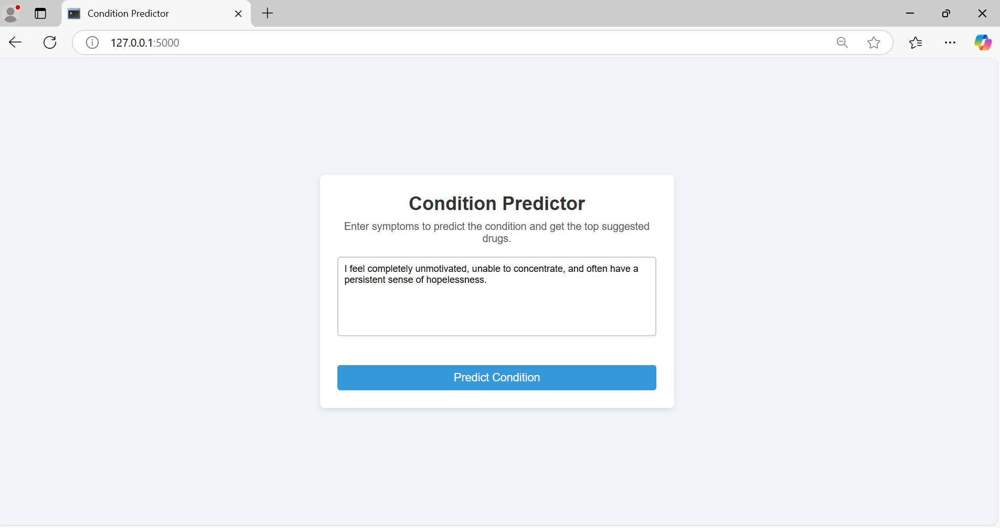
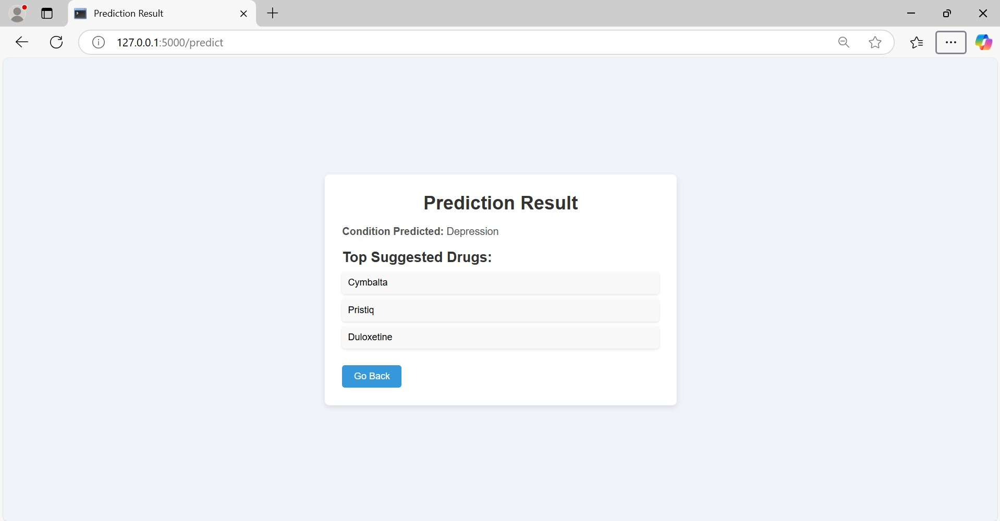
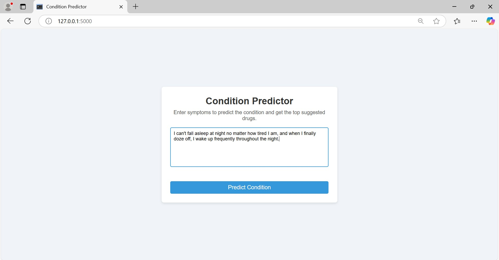
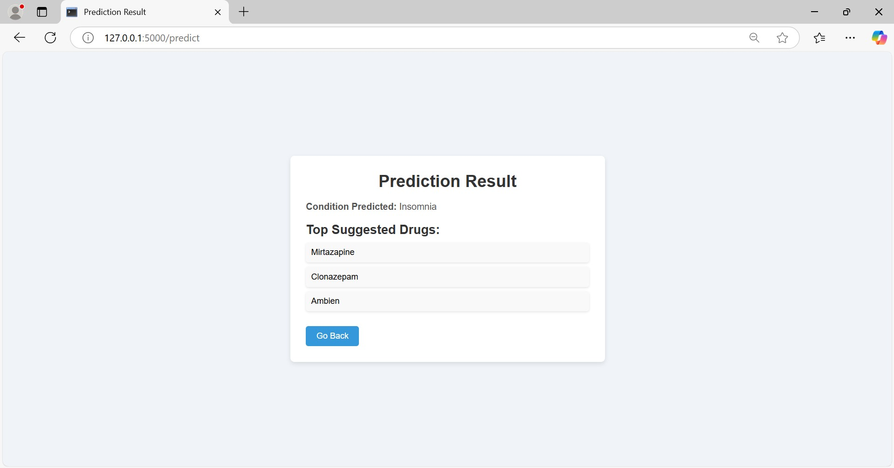

# Patient Condition Classification and Drug Recommendation System

This project aims to classify health conditions based on user-submitted symptoms or medication reviews and recommend the top drugs for the predicted condition. The model is built using machine learning techniques for text classification and drug recommendation.

## Features

- **Condition Classification**: Classifies health conditions based on user input symptoms.
- **Drug Recommendations**: Suggests top-rated drugs based on the predicted condition.
- **Text Preprocessing**: Applies various text processing techniques such as tokenization, stop-word removal, and lemmatization to improve model performance.
- **Machine Learning Model**: Uses a Passive-Aggressive Classifier (PAC) to predict the condition based on processed symptoms.

## Dataset

The project uses the **Drug Review Dataset** from the [UCI Machine Learning Repository](https://archive.ics.uci.edu/dataset/462/drug+review+dataset+drugs+com). The dataset contains:

- **Drug Name**: Name of the drug.
- **Condition**: The medical condition treated by the drug.
- **Review**: User's textual feedback about the drug.
- **Rating**: Patient's rating of the drug on a scale of 1-10.
- **Useful Count**: Count of users who found the review helpful.

## Steps Involved

### 1. Text Cleaning
The input text is cleaned to remove unwanted elements and simplify the text for further processing:
- **Lowercasing**: Converts all text to lowercase to avoid case-sensitive mismatches.
- **Removing Special Characters and Numbers**: Special characters (e.g., @, #, !) and numbers are removed.
  
### 2. Tokenization
- **Tokenization** splits the text into smaller units (tokens), such as words or phrases, to be processed individually.

### 3. Stop Word Removal
- **Stop words** (e.g., "the", "and", "is") are removed to eliminate noise and focus on the most meaningful words in the text.

### 4. Stemming and Lemmatization
- **Stemming** removes suffixes from words (e.g., "running" becomes "run").
- **Lemmatization** converts words to their base dictionary form, considering the context (e.g., "better" becomes "good").

### 5. Vectorization with TF-IDF
- **TF-IDF (Term Frequency-Inverse Document Frequency)** is used to convert text into a numerical format for machine learning models.
  - **Term Frequency (TF)** measures how frequently a term appears in a document.
  - **Inverse Document Frequency (IDF)** penalizes common terms across documents.

### 6. Passive Aggressive Classifier (PAC)
The PAC model is used to classify the symptoms into a specific medical condition:
- **Passive**: If the model makes a correct prediction, it does nothing.
- **Aggressive**: If the model misclassifies, it updates aggressively to correct the prediction.

### 7. Drug Recommendation System
Once the condition is predicted, the system recommends top drugs based on the following criteria:
- **High Ratings**: Only drugs with a rating of 9 or higher are considered.
- **High Usefulness Count**: Drugs with a usefulness count of 100 or more are recommended.
- Drugs are sorted by rating and usefulness, and the top 3 unique drugs are selected.

## Example Workflow

1. **User Input**: A user submits symptoms like "I have trouble sleeping and feel restless all night."
2. **Text Preprocessing**: The symptoms are cleaned, tokenized, and lemmatized.
3. **Condition Prediction**: The preprocessed text is fed into the Passive Aggressive Classifier to predict the condition (e.g., "Insomnia").
4. **Drug Recommendation**: The system recommends the top 3 drugs for the predicted condition based on ratings and usefulness.

### Example:
- **Input Review**: "I have trouble sleeping and feel restless all night."
- **Preprocessing**: ["trouble", "sleeping", "restless", "night"]
- **Predicted Condition**: "Insomnia"
- **Recommended Drugs**:
  - Drug 1: "Drug A"
  - Drug 2: "Drug B"
  - Drug 3: "Drug C"

## Installation

### Requirements
- Python 3.x
- Flask
- pandas
- scikit-learn

### **Project Screenshot**

----